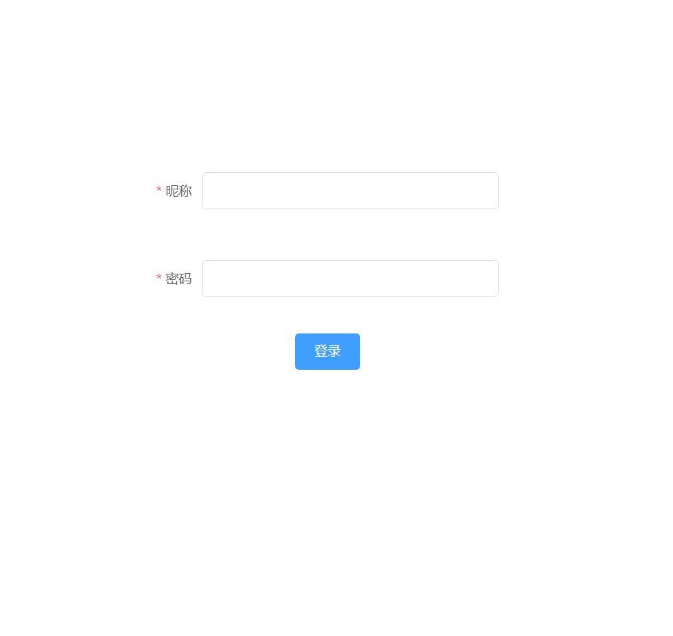
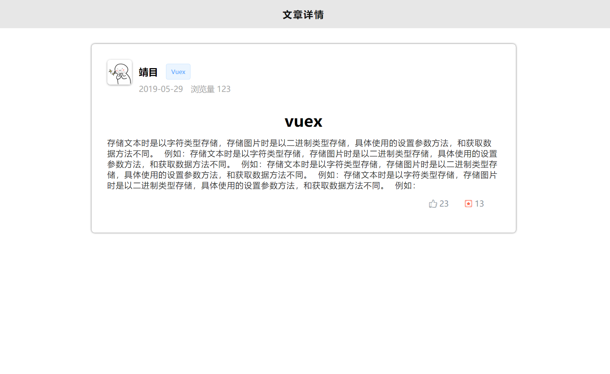

# vueadmin
### 项目的目的：
　　为2020年毕业设计做准备，计划开发一个基于`node`、`vue2.0`、`vuex`、`vueRouter`、`elementUI`、[`express or koa2`] 、`MySQL`、`axios`、`ECharts`等技术实现一个具有`登录`、`注册`、`注销`、`增加`、`删除`、`修改`、`查看`等功能的社团管理网站[多罗罗]。

### 项目技术选型
+ 前端
  + vue
  + vuex
  + vueRouter
  + elementUI
  + koa2 / express
  + axios ajax
  + Echarts
  + stylus
+ 后端 
  + node
  + MySQL

### 项目最终要达到的效果

## 项目流程
### 1. 数据库设计
|表名|说明|设置字段|
|-------|-------|--------|
|userinfo|用户信息表|id[用户id]、name[昵称]、pass[密码]、birth[生日]、sex[性别]、avator[头像]|
|article|文章信息表|articleid[文章Id]、articletitle[标题]、articlecontent[内容]、articletime[发布时间]、articlelike[点赞数量]、articlecollection[收藏数量]、ttpye[文章类型]、articleavator[文章作者]、articlebrief[文章简介]、articlelook[浏览量]|
|usercollection|用户收藏表|id[收藏Id]、articleid[文章id]、username[用户名]、collectiontime[收藏时间]、collstatus[收藏状态]|
|userlikes|用户点赞表|id[点赞id]、articleid[文章id]、username[用户名]、liketime[点赞时间]、starstatus[点赞状态]|


### 2. 初始化项目
#### 克隆github项目 
` git clone https://github.com/aLittleLittleStar/vueAdmin.git`
#### 创建项目 
+ create: `inpty vue.cmd create vueAdmin`
+ 报错：`Invalid project name: "vueAdmin" Warning: name can no longer contain capital letters`
+ 原因： 项目名不能包含大写字母
+ 解决方案： 修改项目名为vueadmin

#### 项目的配置：
```bash
? Please pick a preset: Manually select features

? Check the features needed for your project:
 Babel, Router, Vuex, CSS Pre-processors, Linter

? Use history mode for router? 
(Requires proper server setup for index fallback in production) No
# 是否使用history模式 否

? Pick a CSS pre-processor 
(PostCSS, Autoprefixer and CSS Modules are supported by default): Stylus
# css预编译语言选择 stylus

? Pick a linter / formatter config: Basic
# 语法检查规范类型选择： 基础

? Pick additional lint features: 
(Press <space> to select, <a> to toggle all, <i> to invert selection)Lint on save
# 语法检查： 保存时检查

? Where do you prefer placing config for Babel, 
PostCSS, ESLint, etc.? In package.json
# 自定义配置放置位置 package.json

? Save this as a preset for future projects? No
# 是否在以后的项目中使用以上配置？不
```

#### 项目编译
+ 编译: `npm run serve`
+ 成功: `http://localhost:8081/`

### 3. 编写登录、注册页面
#### 登录
```bash
昵称： 长度在1-8个字符
密码： 6-12位
登录校验顺序：
1. 先检查数据库里面是否存在该用户名： 
    是【判断密码是否正确】
      正确： 提示登录成功并跳转至首页
      错误： 提示密码错误
    否【提示用户不存在】 
```



#### 注册
```bash
昵称： 长度在1-8个字符
密码： 6-12位
确认密码： 和密码一致
性别： 必选
出生日期： 不大于当前时间
注册校验规则： 
  当鼠标失去焦点进行校验
  只有当所有选项符合校验规则，点击立即注册才发送请求
    当点击立即注册：校验用户名是否被占用
    如果被占用： 提示用户名已被占用
    如果未占用： 进行数据的插入，提示注册成功，并跳转至登录页面
```


### 4.文章列表的渲染

### 5.文章详情的渲染

### 6.点赞、收藏
```bash


```

### 7.评论的渲染

### 8.发布文章的校验
```bash
文章标题
文章类别
文章简介
文章内容
长度的限制
```


### 9.排行榜页面

### 10.搜索

### 11.个人主页

### 12.个人中心


