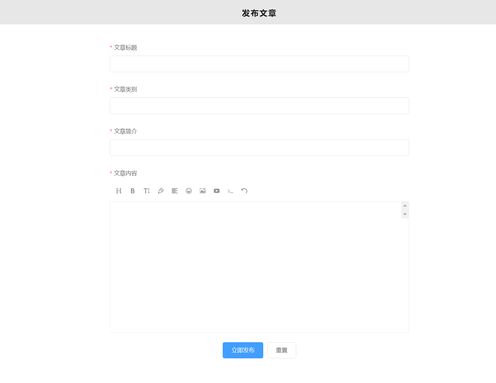
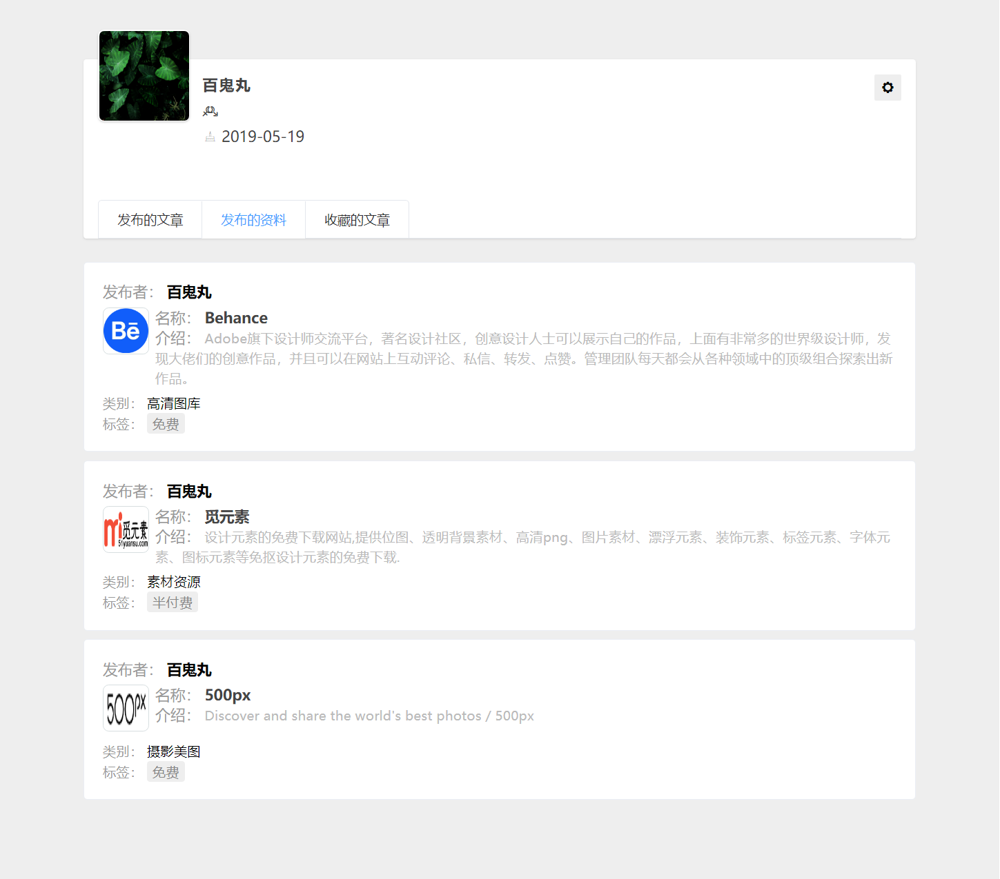

# vueadmin
### 项目的目的：
　　为2020年毕业设计做准备，计划开发一个基于`node`、`vue2.0`、`vuex`、`vueRouter`、`elementUI`、[`express or koa2`] 、`MySQL`、`axios`、`ECharts`等技术实现一个具有`登录`、`注册`、`注销`、`增加`、`删除`、`修改`、`查看`等功能的社团管理网站[多罗罗]。

### 项目技术选型
+ 前端
  + vue
  + vuex
  + vueRouter
  + elementUI
  + koa2 / express
  + axios ajax
  + Echarts
  + stylus
+ 后端 
  + node
  + MySQL

### 项目最终要达到的效果

## 项目目录结构
```bash
+ vueadmin
  + node_nodules # 基础依赖包
  + public 
  + server       # node连接mysql数据库服务
    + api.js     # 函数操作
    + db.js      # 数据库连接配置
    + index.js   # 出口函数 运行 node index
    + router.js  # express 路由
    + sqMap.js   # SQL增删改查语句
  + src
    + assets     # 静态资源储存
      + common   # 公共的资源
        + fonts  # 字体
        + image  # 图片
        + js     # js
        + stylus # css样式
      + say      # README上面展示的图片
    + components # 页面组件
      + article  # 文章页面
      + data-list   # 学习资料列表页面
      + editor      # WangEditor富文本编译器组件
      + header      # 头部组件
      + login       # 登录页面
      + publish     # 发布文章页面
      + recommend   # 推荐页面【首页】
      + register    # 注册页面
      + search-info # 搜索学习资料结果页面
    + App.vue    # 整个项目的入口文件，相当于包裹整个页面的最外层的div
    + main.js    # 项目的主js,全局的使用的各种变量、js、插件 都在这里引入 、定义。
    + router.js  # vueRouter路由
    + store.js   # vuex

```

## 项目流程
### 1. 数据库设计
|表名|说明|设置字段|
|-------|-------|--------|
|userinfo|用户信息表|id[用户id]、name[昵称]、pass[密码]、birth[生日]、sex[性别]、avator[头像]|
|article|文章信息表|articleid[文章Id]、articletitle[标题]、articlecontent[内容]、articletime[发布时间]、articlelike[点赞数量]、articlecollection[收藏数量]、ttpye[文章类型]、articleavator[文章作者]、articlebrief[文章简介]、articlelook[浏览量]|
|usercollection|用户收藏表|id[收藏Id]、articleid[文章id]、username[用户名]、collectiontime[收藏时间]、collstatus[收藏状态]|
|userlikes|用户点赞表|id[点赞id]、articleid[文章id]、username[用户名]、liketime[点赞时间]、starstatus[点赞状态]|


### 2. 初始化项目
#### 克隆github项目 
` git clone https://github.com/aLittleLittleStar/vueAdmin.git`
#### 创建项目 
+ create: `inpty vue.cmd create vueAdmin`
+ 报错：`Invalid project name: "vueAdmin" Warning: name can no longer contain capital letters`
+ 原因： 项目名不能包含大写字母
+ 解决方案： 修改项目名为vueadmin

#### 项目的配置：
```bash
? Please pick a preset: Manually select features

? Check the features needed for your project:
 Babel, Router, Vuex, CSS Pre-processors, Linter

? Use history mode for router? 
(Requires proper server setup for index fallback in production) No
# 是否使用history模式 否

? Pick a CSS pre-processor 
(PostCSS, Autoprefixer and CSS Modules are supported by default): Stylus
# css预编译语言选择 stylus

? Pick a linter / formatter config: Basic
# 语法检查规范类型选择： 基础

? Pick additional lint features: 
(Press <space> to select, <a> to toggle all, <i> to invert selection)Lint on save
# 语法检查： 保存时检查

? Where do you prefer placing config for Babel, 
PostCSS, ESLint, etc.? In package.json
# 自定义配置放置位置 package.json

? Save this as a preset for future projects? No
# 是否在以后的项目中使用以上配置？不
```

#### 项目编译
+ 编译: `npm run serve`
+ 成功: `http://localhost:8081/`

### 3. 编写登录、注册页面
#### 登录
```bash
昵称： 长度在1-8个字符
密码： 6-12位
登录校验顺序：
1. 先检查数据库里面是否存在该用户名： 
    是【判断密码是否正确】
      正确： 提示登录成功并跳转至首页
      错误： 提示密码错误
    否【提示用户不存在】 
```


#### 注册
```bash
昵称： 长度在1-8个字符
密码： 6-12位
确认密码： 和密码一致
性别： 必选
出生日期： 不大于当前时间
注册校验规则： 
  当鼠标失去焦点进行校验
  只有当所有选项符合校验规则，点击立即注册才发送请求
    当点击立即注册：校验用户名是否被占用
    如果被占用： 提示用户名已被占用
    如果未占用： 进行数据的插入，提示注册成功，并跳转至登录页面
```


### 4.文章列表的渲染

### 5.文章详情的渲染

### 6.点赞、收藏
```bash


```

### 7.评论的渲染

### 8.发布文章的校验
```bash
文章标题
文章类别
文章简介
文章内容
长度的限制
```


### 9.排行榜页面

### 10.搜索

### 11.个人主页

### 12.个人中心


### 首页：分页功能的实现2019/5/30
```bash
基本思路：
1、首先获取当前页面数据的总条数
> select count(*) from article
对数据进行处理： 求余数、上相取整
> let num = res.data[0]['count(*)'];
> let Remain = num % 10;
> let Len = num / 10;
> Len = Math.floor(Len);
当除以10余数大于0时：页数的长度 为 Len+1
设置当前页面为1、页面总长度为Len
2、渲染页面时：第一次加载十条数据
当点击上一页下一页时根据当前页码进行请求数据

```

### 2019/6/3
#### 添加搜索页面、搜索框事件
> elementUI input 输入框键盘事件
`@keyup.native.enter="searchList"`


### 2019/6/4
#### 添加loading动画
添加页面： 
  + 首页、学习资源、文章详情

#### 新建个人主页页面：未完成数据交互
##### 发布的文章、发布的资料
### 2019/6/5
#### 个人主页页面:添加展示收藏文章的交互
##### 效果图




##### 基本思路
```absh
个人主页展示：
  个人的基本信息
    头像、昵称、性别、生日
  主体部分
    发布的文章
    发布的资料
    收藏的文章
如何实现：
  个人基本资料： 根据用户昵称获取 userInfo 表里面用户的信息
  发布的文章： 根据用户昵称获取 article 表里面用户发布的文章
  发布的资料： 根据用户昵称获取 learndata 表里面用户发布的资料
  收藏的文章： 
    首先： 根据用户名及收藏的状态获取 usercollection 表里面用户收藏文章的Id
    第二： 根据收藏的id长度循环请求 article 表里面文章详情
    第三： 将循环获取的数据保存在 collectionArtDelList 数组里
    第四： 通过 v-for 循环遍历 collectionArtDelList 里的数据
    第五： 和以前的json不同 这里的 循环元素为 item[0]
```

##### 待解决
1. 如果没有发布文章、资料和收藏文章的样式【有点麻烦】
2. 点击有上角设置按钮：跳转到个人中心页面对自己的资料进行设置【必要】

##### 后期优化
1. 在查找用户收藏文章的时候，MySQL查询语句太多，请求次数太多
2. server服务端api函数太多，严重影响后期代码的编写及维护，准备抽取出小组件，把处理文章、资料、点赞、收藏等的请求分别放到单独的文件里便于管理及书写

### 2019/6/6
```bash
1. 完善点击用户名跳转到个人主页的路由
2. 新建个人中心页面【基本骨架已搭建，交互逻辑未完成】
```


